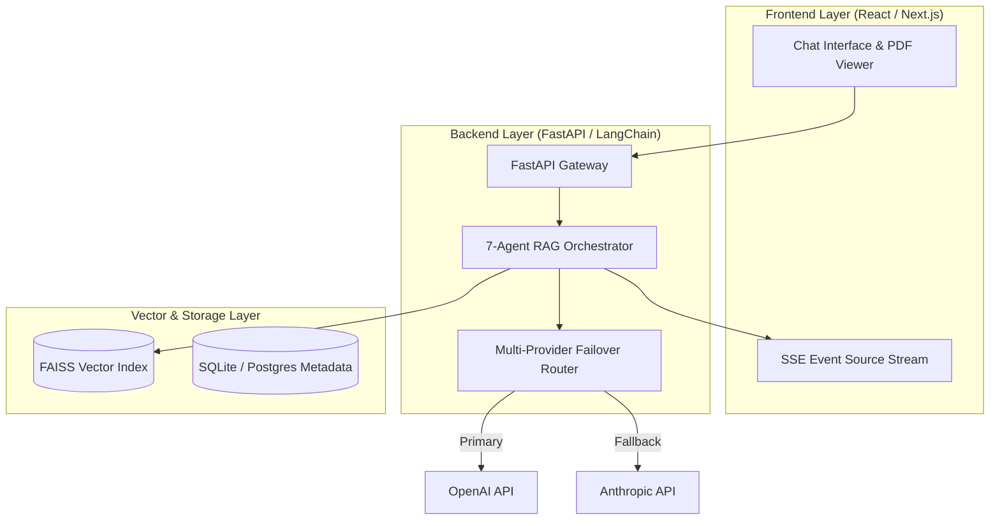

# System Architecture Document — PaperBrain

**Project Name:** PaperBrain  
**Author:** Nachiket Gadilohar  

---

## 1. System Overview & Tech Stack

### Tech Stack Details:
- **Frontend**: React, TypeScript, Tailwind CSS, PDF.js.
- **Backend API**: FastAPI, Uvicorn, Python 3.11.
- **Orchestration**: LangChain, Custom StateGraph Agents.
- **Vector Database**: FAISS (Facebook AI Similarity Search).
- **Embeddings**: OpenAI Embeddings / HuggingFace Transformers.
