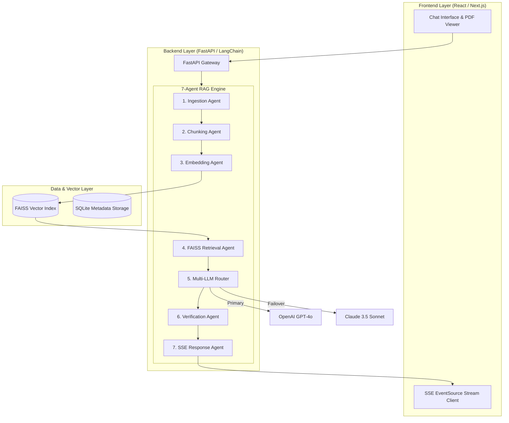
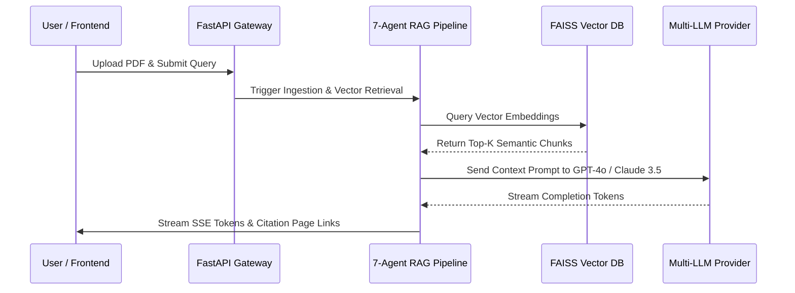

# System Architecture Document — PaperBrain

**Project Name:** PaperBrain  
**Author:** Nachiket Gadilohar  

---

## 1. System Overview & Recommended Tech Stack

| Layer | Technology | Rationale |
| :--- | :--- | :--- |
| **Frontend UI** | React / Next.js, TypeScript, Tailwind CSS, PDF.js | High-performance split workspace rendering & interactive canvas highlighting. |
| **Backend API** | FastAPI, Uvicorn, Python 3.11 | Asynchronous HTTP & native Server-Sent Events (SSE) support. |
| **Agent Orchestration** | LangChain, StateGraph | Stateful multi-agent execution pipeline. |
| **Vector Storage** | FAISS (Facebook AI Similarity Search) | High-speed, local in-memory vector search. |
| **Embeddings** | OpenAI Embeddings / HuggingFace Transformers | Dense 1536-dim semantic representation. |
| **LLM Providers** | OpenAI (GPT-4o) & Anthropic (Claude 3.5 Sonnet) | Primary and zero-downtime failover model providers. |

---

## 2. System Architecture Diagram

---

## 3. Data Flow Sequence

---

## 4. API Endpoints Specification
- POST /api/upload: Upload PDF file and initialize 7-agent pipeline.
- GET /api/query/stream: Stream RAG response tokens via SSE.
- GET /api/document/:id: Retrieve document metadata and citation page markers.
