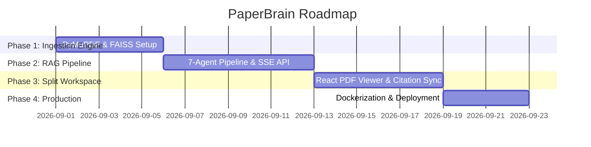

# Development Plan & Roadmap — PaperBrain

**Project Name:** PaperBrain  
**Author:** Nachiket Gadilohar  

---

## 1. Roadmap & Phase Breakdown

---

## 2. Definition of Done (DoD)
1. 100% of 7 agents execute cleanly in sequence.
2. Citation pills highlight exact PDF coordinates.
3. Sub-second TTFT streaming via SSE verified.
